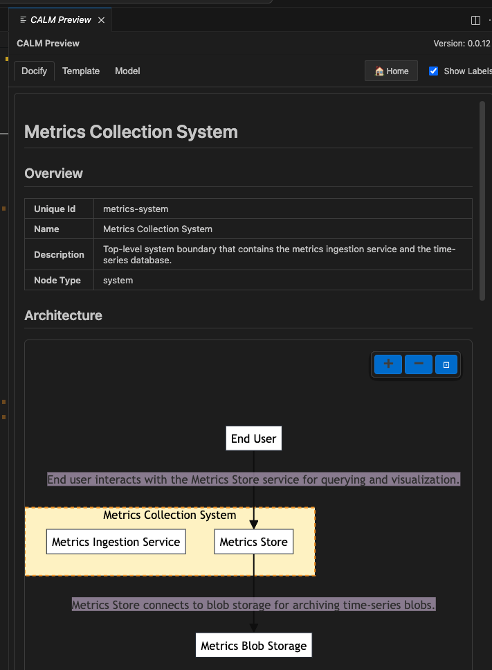

# My Advent of CALM Journey

This repository tracks my 24-day journey learning the Common Architecture Language Model (CALM).

## Progress

- [x] Day 1: Install CALM CLI and Initialize Repository
- [x] Day 2: Create Your First Node
- [x] Day 3: Connect Nodes with Relationships
- [x] Day 4: Install CALM VSCode Extension
- [x] Day 5: Add Interfaces to Nodes
- [x] Day 6: Document with Metadata

...

## Architectures

This directory will contain CALM architecture files documenting systems.

## Patterns

This directory will contain CALM patterns for architectural governance.

## Docs

Generated documentation from CALM models.

## Tools

- **CALM CLI** (installed Day 1)
	- What it's used for: generation, validation, and templates for CALM artifacts.
	- Basic commands:
		- `calm generate -t <template> -o <file>` — generate an architecture or pattern from a template
		- `calm validate -a <file>.architecture.json` — validate an architecture against CALM (JSON Schema + Spectral rules)
		- `calm init` — initialize a CALM workspace or scaffold files from templates
	- Notes: the CLI is the authoritative validator and will report JSON Schema and spectral validation issues. Run the CLI before committing architecture files.

- **CALM VSCode Extension** (installed Day 4)
	- Marketplace: https://marketplace.visualstudio.com/items?itemName=FINOS.calm-vscode-plugin
	- What it provides: visualization, tree navigation for CALM documents, and a live preview of architectures and patterns.
	- Keyboard shortcut: `Ctrl+Shift+C` (Windows/Linux) or `Cmd+Shift+C` (macOS) to open the CALM live preview.

- **How these tools work together**
	- Use the VSCode extension for editing, browsing, and visually previewing your CALM models while you work.
	- Use the CALM CLI to generate scaffolding/templates and to run authoritative validation (`calm validate`) before committing changes.
	- Recommended workflow:
		1. Edit architecture files in VSCode and inspect them with the extension preview (`Ctrl+Shift+C` / `Cmd+Shift+C`).
		2. Run `calm validate -a architectures/my-first-architecture.json` locally to catch schema or spectral issues.
		3. Fix any issues identified, re-preview, then commit and push.

## Screenshot of CALM VSCode Preview

