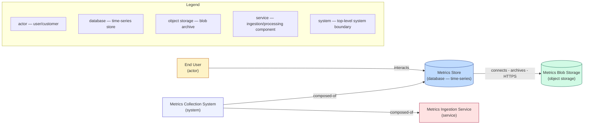

# Architecture diagram — Metrics Collection System

This Mermaid diagram visualizes the CALM architecture defined in `architectures/my-first-architecture.json`.

---

Notes:
- Node IDs in the CALM file: `metrics-store`, `metrics-blob-storage`, `end-user`.
- Relationships shown: `end-user-interacts-with-metrics-store` (interacts), `metrics-store-to-blob-storage` (connects).
 - Node IDs in the CALM file: `metrics-store`, `metrics-blob-storage`, `end-user`, `metrics-service`, `metrics-system`.
 - Relationships shown: `end-user-interacts-with-metrics-store` (interacts), `metrics-store-to-blob-storage` (connects), `metrics-system-composed-of` (composed-of).
- To render this diagram locally you can open this Markdown in editors that support Mermaid (VS Code with Mermaid Preview, GitHub README rendering, or Mermaid Live Editor).
